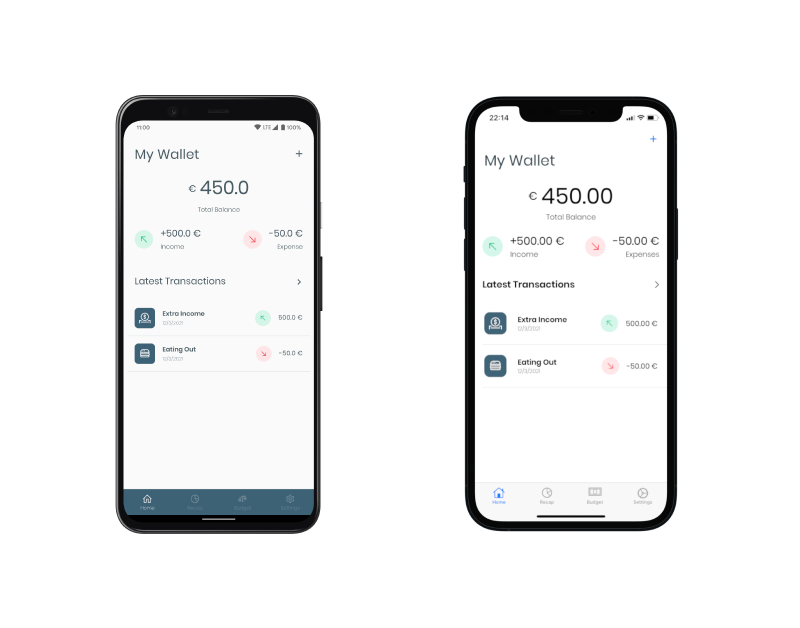
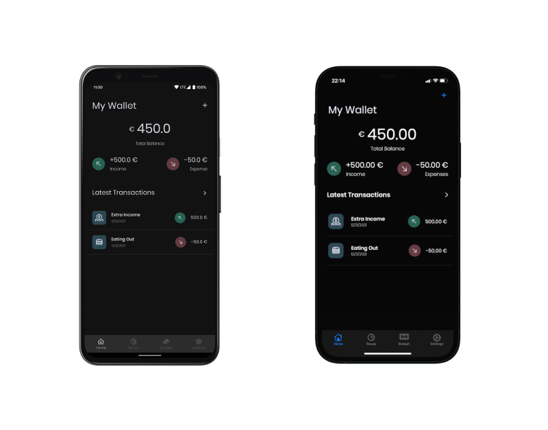

# CashFlow APP
This is and Android and iOS app written in  Kotlin Multiplatform( Jetpack Compose and Swift UI) 
to help you manage your finances and develop healthy financial habits that stick.

The app is still work in progress  and the following are the features intended:
- ✅ Transaction Entry
- ✅ Edit Transaction
- ✅ Transaction category
- ✅ Add custom transaction category
- ✅ Budgeting feature
- ✅ Import and export Data
- ✅ Sync data with Dropbox
- ✅ Visualize the patterns in the transactions(In progress)

## CashFlow app in pictorials

<div align="center">
  
</div>

MoneyFlow comes also in dark 🌃:

<div align="center">
  
</div>


## How to build:

In order to build the iOS project, you will need to add a `Config.xcconfig` file inside the [iosApp/Assets](https://github.com/prof18/MoneyFlow/tree/main/iosApp/Assets) folder, with the content of the [Config.xcconfig.template](https://github.com/prof18/MoneyFlow/blob/main/iosApp/Assets/Config.xcconfig.template) file. 

### Dropbox sync:

If you want to run the Dropbox sync, you need to create a Dropbox App [here](https://www.dropbox.com/developers/) and get an API key. For iOS, you need to provide also the URL scheme and both need to be placed in the `Config.xcconfig` file created above:

```xcconfing
DROPBOX_URL_SCHEME=db-<your-api-key>
DROPBOX_API_KEY=<your-api-key>
```

On Android, you only need the   key, which must be included in the `local.properties` in the root project dir:

```properties
dropbox.app_key=<your-api-key>
```

=======
# CashFlowAPP
>>>>>>> 367fd005cb46609465a496c0b5d18e99cfed0440
